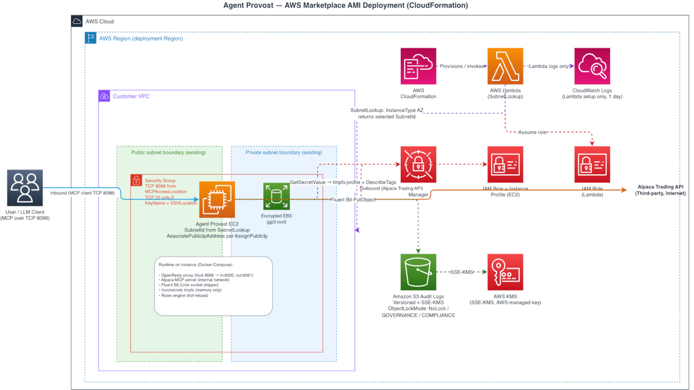

# LLM Provost

Governance proxy and audit ledger for MCP-mediated LLM interactions.

<p align="center">
  
</p>

LLM Provost is a mandatory policy and observability boundary that sits in front of MCP servers and upstream model/tool APIs.
It is designed for secure, sovereign operation: you run it in your own environment, control the policy file, and own the audit logs.

## What It Does

LLM Provost provides all of the following in one control point:

1. Governance checks on MCP tool calls
2. Identity-aware structured audit logs
3. Two-hop request/response traceability
4. Hot-reload policy updates without proxy restarts

## Four-Point Audit Trail

For normal governed traffic, LLM Provost captures and correlates these four events:

1. LLM client request enters the llm-to-mcp boundary
2. MCP server request exits through the mcp-to-upstream boundary
3. Upstream response returns to MCP through the same boundary
4. MCP response returns to the LLM client through the inbound boundary

Correlation fields used across hops:

- provost_user
- provost_machine
- provost_request_id

## Seven Core Controls

The current implementation and policy model center around these seven controls:

1. Programmable governance guardrails (allow/block tool calls)
2. Per-tool rate limiting
3. Token caps for tool requests
4. Time-based access controls
5. Identity-rich audit logging
6. Hot-reload rules from rules.json (10-second mtime polling)
7. Containerized deployment for repeatable operations

## Architecture

Two enforcement boundaries are active:

1. llm-to-mcp (inbound): LLM client -> LLM Provost (port 8000) -> MCP server
2. mcp-to-upstream (outbound): MCP server -> LLM Provost -> approved upstream API/tool endpoint

This "double-proxy" model gives you policy enforcement before outbound calls leave your trust boundary, and full hop-level observability for audit and incident response.

Reference diagram:

<p align="center">
  
</p>

## Open Source Quickstart (Docker Compose)

For open-source users who want to run locally:

```sh
git clone https://github.com/CharmingSteve/llm-provost.git
cd llm-provost

# clear prior local secret staging if present
unset PROVOST_SECRETS_DIR
docker compose down

# stage env vars for compose from .env
eval "$(sh bootstrap.sh dev)"

# run stack
docker compose --env-file .env.versions up -d
```

Default local entry points:

- LLM Provost gateway: http://localhost:8000
- LibreChat (if enabled in compose): http://localhost:3080

To stop:

```sh
docker compose --env-file .env.versions down
```

## Client and POC Notes

The current POC wiring uses OpenWire from VS Code/OpenAI-compatible client flows, but you are not locked into that.
Any client that can call an OpenAI-compatible endpoint and/or MCP endpoint through LLM Provost can be used.

In this repository, example integration is shown in [config/librechat.yaml](config/librechat.yaml) where:

- OpenWire-style endpoint traffic is routed through http://llm-provost:8000/v1
- MCP tool traffic is routed through /mcp/<server>

## Governance Policy Model

Policy is defined in [rules.json](rules.json) and evaluated by Lua in [lua/rules_engine.lua](lua/rules_engine.lua).
The schema currently includes:

- tool_allowlist
- tool_blocklist
- rate_limits
- token_caps
- time_based_rules
- logging_rules

Policy reload behavior:

- rule loader polls rules.json every 10 seconds
- valid updates become active without nginx reload
- invalid updates are rejected and last known good policy remains active

See [RULES_ENGINE.md](RULES_ENGINE.md) for full rule documentation.

## Logging and Sovereignty

LLM Provost emits structured JSON logs with request and response body capture for governed paths.
In the default stack, Fluent Bit ships logs to local files and optional S3 outputs.

Key operational intent:

- keep policy enforcement and logs inside your cloud account
- maintain immutable audit posture with versioned object storage and encryption controls
- minimize trust in upstream components by enforcing at the proxy boundary

## AWS Marketplace Deployment

LLM Provost is also available as an AWS Marketplace AMI:

https://aws.amazon.com/marketplace/pp/prodview-ouyql6wbwo6yg

High-level flow:

1. Subscribe and launch CloudFormation
2. Set PROVOST_TOKEN and governance parameters
3. Wait for CREATE_COMPLETE
4. Point your MCP/LLM client at the deployed endpoint

## Security Posture Highlights

- no-new-privileges and dropped Linux caps for core containers
- read-only root filesystem on proxy and log shipper containers
- tmpfs for transient runtime data
- internal Docker network for mcp_internal traffic
- explicit policy evaluation before MCP tool execution

## License

This project is licensed under GNU Affero General Public License v3.0 (AGPL-3.0).
See [LICENSE](LICENSE).

## Support

Open an issue or discussion if you need changes to the governance model, deployment shape, or compliance posture.
