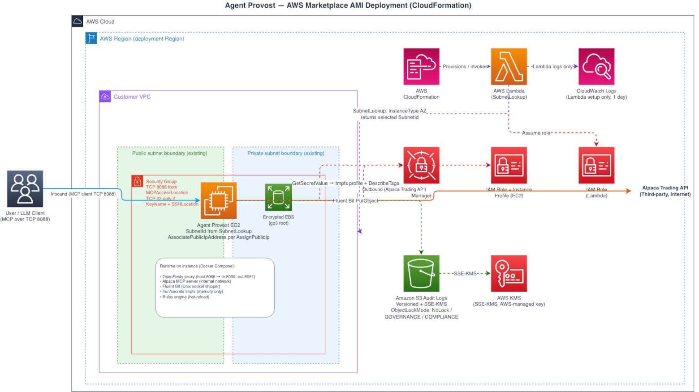

# LLM Provost

Governance proxy and audit ledger for MCP-mediated LLM interactions.

<p align="center">
  
</p>

LLM Provost is a mandatory policy and observability boundary that sits in front of MCP servers and upstream model/tool APIs.
It is designed for secure, sovereign operation: you run it in your own environment, control the policy file, and own the audit logs.

## What It Does

LLM Provost provides all of the following in one control point:

[](https://www.youtube.com/watch?v=BEWJ4VHBHFk)


**👉 Launch on AWS Marketplace:** [LLM Provost AMI](https://aws.amazon.com/marketplace/pp/prodview-ouyql6wbwo6yg) soon!


## Four-Point Audit Trail

For normal governed traffic, LLM Provost captures and correlates these four events:

1. LLM client request enters the llm-to-mcp boundary
2. MCP server request exits through the mcp-to-upstream boundary
3. Upstream response returns to MCP through the same boundary
4. MCP response returns to the LLM client through the inbound boundary

Correlation fields used across hops:

- provost_user
- provost_machine
- provost_request_id

## Core Controls

The current implementation and policy model include:

1. Programmable governance guardrails (allow/block tool calls)
2. Per-tool rate limiting
3. Token caps for tool requests
4. Time-based access controls
5. Identity-rich audit logging
6. LLM chat governance on non-MCP paths (`llm_rules`: PII filtering + token caps)
7. Per-MCP-server policy dispatch (`mcp_servers.<server>`)
8. Alpaca trading controls imported from Agent Provost (size/notional limits, symbol controls, forbidden endpoints, order replacement/close protections, optional trading window)
9. Four-layer identity restoration on the outbound MCP-to-API boundary
10. Hot-reload rules from rules.json (10-second mtime polling)
11. Containerized deployment for repeatable operations

## Agent Provost Features Imported

This branch includes Agent Provost imports for governed Alpaca MCP usage:

- Dedicated `alpaca-mcp` service routed through LLM Provost (`/mcp/alpaca`).
- Outbound MCP-to-API governance boundary on port `8081` for trading/data/broker API calls.
- Deterministic trading rule engine (`lua/trading_rules.lua`) wired through `rules_engine.lua` per-server dispatch.
- Agent Provost rule aliases supported in policy (for example `max_notional -> max_trade_notional`, `symbol_allowlist -> allowed_tickers`, `forbidden_endpoints -> forbidden_tools`).
- Runtime outbound identity context restoration (`lua/outbound_identity.lua`) so audit logs preserve provost identity even when upstream headers are dropped.
- Alpaca startup behavior aligned with Agent Provost entrypoint/runtime expectations.

## Architecture

Two enforcement boundaries are active:

1. llm-to-mcp (inbound): LLM client -> LLM Provost (port 8000) -> MCP server
2. mcp-to-upstream (outbound): MCP server -> LLM Provost -> approved upstream API/tool endpoint

This "double-proxy" model gives you policy enforcement before outbound calls leave your trust boundary, and full hop-level observability for audit and incident response.

Reference diagram:

<p align="center">
  
</p>

## Open Source Quickstart (Docker Compose)

For open-source users who want to run locally:

```sh
git clone https://github.com/CharmingSteve/llm-provost.git
cd llm-provost

# clear prior local secret staging if present
unset PROVOST_SECRETS_DIR
docker compose down

# stage env vars for compose from .env
eval "$(sh bootstrap.sh dev)"

# run stack
docker compose --env-file .env.versions up -d
```

Default local entry points:

- LLM Provost gateway: http://localhost:8000
- LibreChat (if enabled in compose): http://localhost:3080

To stop:

```sh
docker compose --env-file .env.versions down
```

## Client and POC Notes

The current POC wiring uses OpenWire from VS Code/OpenAI-compatible client flows, but you are not locked into that.
Any client that can call an OpenAI-compatible endpoint and/or MCP endpoint through LLM Provost can be used.

In this repository, example integration is shown in [config/librechat.yaml](config/librechat.yaml) where:

- OpenWire traffic is routed through http://llm-provost:8000/llm/openwire/v1
- Ollama traffic is routed through http://llm-provost:8000/llm/ollama/v1
- MCP tool traffic is routed through /mcp/<server>

### Multiple LLM Backends

Define every allowed LLM backend in `.env` as one JSON object. Backend names become the first path segment after `/llm/`, and each value is the upstream API base URL:

```sh
LLM_ROUTES_JSON={"openwire":"http://host.docker.internal:3030/v1","ollama":"http://xps:11434/v1","bedrock":"https://bedrock-runtime.us-east-1.amazonaws.com"}
```

A client configured with `http://llm-provost:8000/llm/openwire/v1` therefore sends chat completions to the `openwire` URL. Add another backend by adding a unique lowercase name and an HTTP or HTTPS URL to the JSON object, then restart the proxy so OpenResty reloads its environment. Unknown backend names return HTTP 404; missing, malformed, or invalid routing configuration fails closed with HTTP 500. There is no single-backend fallback.

Keep credentials in their existing environment variables, such as `OPENAI_API_KEY` and `OLLAMA_API_KEY`; do not put credentials in backend URLs. LLM requests continue through the same policy, Cognito identity extraction, four-layer ID logging, request/response audit capture, and authorization forwarding used by the original route. MCP routing remains configured separately in `mcp_routes.json`.

### Routing Tests

Run the focused routing checks from the repository root:

```sh
busted tests/lua/proxy_headers_spec.lua tests/lua/circuit_breaker_spec.lua
bats tests/shell/test_entrypoint.bats tests/shell/test_verify_proxy_routing.bats
```

For a running stack, `sh verify_proxy_routing.sh` probes `/llm/openwire/v1/chat/completions` and `/mcp/dummy`, verifies the four identity layers, and checks that the bearer token is absent from logs.

### LibreChat + Cognito Identity

When LibreChat is used with Cognito, the recommended setup is:

- request the `openid profile email phone` scope set in Cognito
- map LibreChat's display name to `given_name` so the greeting uses the user's first name
- forward LibreChat's authenticated user ID to the proxy as `X-Cognito-User`

The local stack keeps the LibreChat OpenID settings in the mounted `.env` file so a rebuild does not wipe out Cognito login. The compose file no longer duplicates those OpenID variables at service level.

## Governance Policy Model

Policy is defined in [rules.json](rules.json) and evaluated by Lua in [lua/rules_engine.lua](lua/rules_engine.lua).
The schema currently includes:

- tool_allowlist
- tool_blocklist
- rate_limits
- token_caps
- time_based_rules
- logging_rules
- llm_rules
- mcp_servers (per-server overrides and deterministic rules, including `alpaca`)

The `mcp_servers.alpaca` policy block supports imported Agent Provost controls including:

- share quantity limit (`max_trade_size`/`share_limits`)
- single-order notional cap (`max_trade_notional`/`max_notional`)
- rolling cumulative notional cap (`cumulative_trade_notional`)
- per-symbol order cooldown (`symbol_order_cooldown`)
- symbol blocklist and draconian allowlist (`blocked_tickers`/`symbol_blocklist`, `allowed_tickers`/`symbol_allowlist`)
- allowed asset classes (`allowed_asset_classes`)
- restricted ticker-by-tool enforcement (`restricted_ticker_tool_rules`)
- forbidden outbound endpoint templates (`forbidden_tools`/`forbidden_endpoints`)
- replacement order protections (`max_replace_notional`, `prevent_market_order_upgrade`)
- close-position protections (`max_close_notional`, `allowed_close_tickers`)
- optional UTC trading window (`trading_window`)

Policy reload behavior:

- rule loader polls rules.json every 10 seconds
- valid updates become active without nginx reload
- invalid updates are rejected and last known good policy remains active

See [RULES_ENGINE.md](RULES_ENGINE.md) for full rule documentation.

## Logging and Sovereignty

LLM Provost emits structured JSON logs with request and response body capture for governed paths.
The proxy resolves `user_id` from `X-Cognito-User` when LibreChat forwards an authenticated user email, and falls back to the Cognito JWT `sub` or email claim when needed.
In the default stack, Fluent Bit ships logs to local files and optional S3 outputs.

Audit bodies use compact mode by default. JSON is minified, model lists are summarized with their count and model IDs, and recognized OpenAI-compatible, Ollama, Anthropic, Responses API, and Gemini SSE streams are reconstructed into ordered semantic records. Each response record contains at most 8 KiB of semantic text and a monotonic `chunk` index; the final record sets `complete:true`. There is no total response or record-count limit, so content, reasoning, and tool-call arguments in the middle of million-word responses remain auditable without buffering the full response in proxy memory. Malformed or oversized SSE events are preserved as bounded `unparsed_sse_payload` or `unparsed_sse_fragment` records rather than discarded.

Streaming records are sent over the internal Compose network to Fluent Bit and independently mirrored to the proxy's standard output. If the bounded transport-outage queue fills, response processing fails closed instead of silently passing unaudited content. Interrupted streams retain their partial semantic records and produce a structured error record for client aborts, upstream failures, or post-header interruptions. Empty request bodies remain empty, credential-like request fields are recursively replaced with `[REDACTED]`, and repeated LibreChat conversation histories are summarized to keep request records useful.

Set `AUDIT_LOG_MODE=raw` in the deployment environment and restart the Compose stack to retain SSE wire data in ordered bounded records for diagnostics. Raw mode is intentionally deployment-scoped and cannot be enabled with a client request header. Local enriched JSON Lines records are written to `logs/fluent-bit-storage/access.log` and `logs/fluent-bit-storage/error.log`.

Key operational intent:

- keep policy enforcement and logs inside your cloud account
- maintain immutable audit posture with versioned object storage and encryption controls
- minimize trust in upstream components by enforcing at the proxy boundary

## AWS Marketplace Deployment

LLM Provost is also available as an AWS Marketplace AMI:

https://aws.amazon.com/marketplace/pp/prodview-ouyql6wbwo6yg

High-level flow:

1. Subscribe and launch CloudFormation
2. Set PROVOST_TOKEN and governance parameters
3. Wait for CREATE_COMPLETE
4. Point your MCP/LLM client at the deployed endpoint

## Security Posture Highlights

- no-new-privileges and dropped Linux caps for core containers
- read-only root filesystem on proxy and log shipper containers
- tmpfs for transient runtime data
- internal Docker network for mcp_internal traffic
- explicit policy evaluation before MCP tool execution

## License

This project is licensed under GNU Affero General Public License v3.0 (AGPL-3.0).
See [LICENSE](LICENSE).

## Support

Open an issue or discussion if you need changes to the governance model, deployment shape, or compliance posture.
